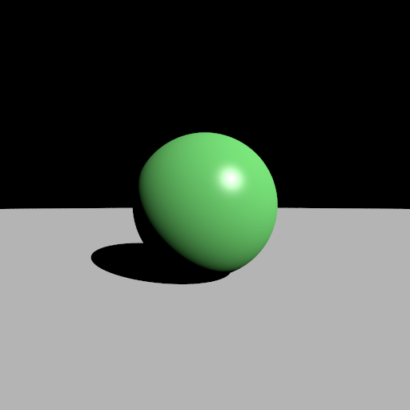
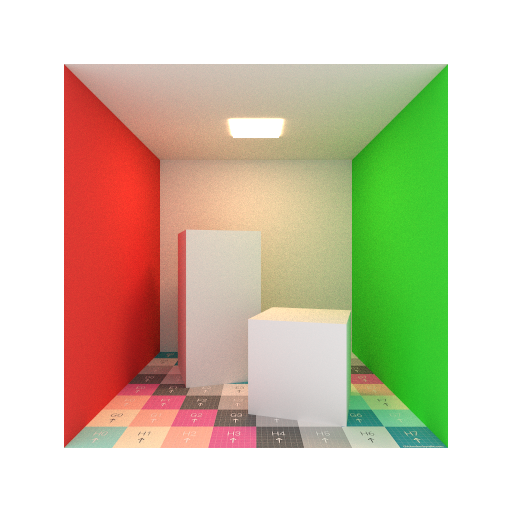
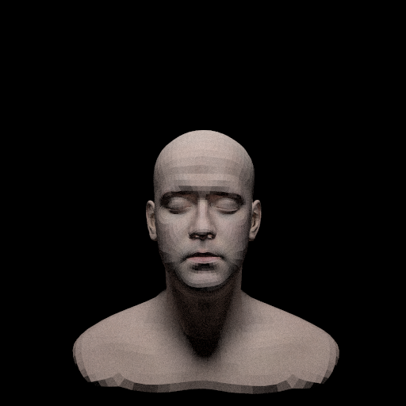

# mcrt-intro

Introduction to monte carlo ray tracing

## Requirements

* C++ 17
* CMake 3.20
* OpenMP

## Build

```
git submodule update --init --recursive
mkdir build
cd build
cmake ..
make
```

## Structure

Each directory has reference implementation under `reference/`.

|Directory|Description|
|:--|:--|
|`1-classical-raytracer/`|Start raytracing journey with implementation of classical raytracer|
|`2-simple-pt/`|Introduce physically based rendering theory and implement simple path tracer|
|`3-pt/`|Implement obj load, texture, image based lighting(IBL), thin lens camera model|
|`4-bvh/`|Implement bounding volume hierarchy(BVH) and render some obj model|
|`5-ggx/`|Implement GGX microfacet BRDF|
|`6-disney-brdf/`|Implement Disney BRDF|
|`7-nee/`|Implement next event estimation(NEE)|
|`8-mis/`|Implement multiple importance sampling(MIS)|

## Gallery

### 1-classical-raytracer



### 2-simple-pt


### 3-pt



### 4-bvh

